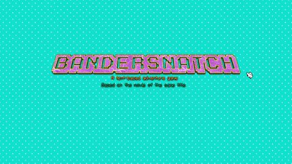

# Bandersnatch

### Summary
Text-Based Adventure Game to play in the browser based on the interactive movie by Black Mirror of the same name.

###### DISCLAIMER: Most of the plot and graphics of this game belong to their respective owners and I do not claim any right over them.

### Tech used
  - Javascript
  - React.js
  - Webpack as a module bundler
  - HTML
  - CSS
  - NES.css
  - TypeIt

### Other resources
  - Pulse Boy
  - Retromancers
  - Textcraft
  - Animista

### Features
  - Retro style
  - Background music
  - Mute/unmute option
  - Exit/restart option
  - Background color customization
  - On/off typewriter animation
  - 404 error page

### Inspiration
  - A command line game that I've built with Node.js
  - Bandersnatch
  - [MangoMartin](https://github.com/MangoMartin)

### Set-up
This repo contains a package.json that lists all of the dependencies the project is expected to require. To install them, cd into the directory and type the following.

    $npm install

### TODOs
1. Improve:
    - Add more paths
    - Clean code (especially unnecessary dependencies)
2. Add new features:
    - Include more keyboard options
    - Add more animations
